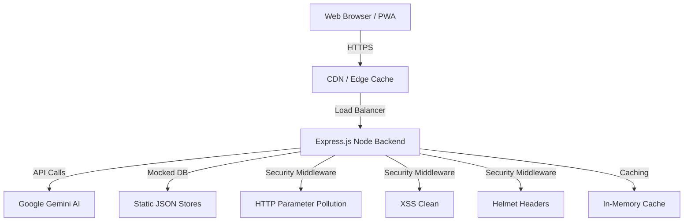

# System Architecture

## Overview

MetLife Assist is designed as a secure, highly-available monolithic web application to serve real-time stadium data and AI-driven concierge services during the 2026 FIFA World Cup.

## Architecture Diagram

## Security Posture

- **XSS Protection**: `xss-clean` middleware sterilizes incoming payloads.
- **DDoS Mitigation**: `express-rate-limit` throttles aggressive traffic (100 req/15min).
- **HPP Protection**: `hpp` middleware guards against query string attacks.

## Scalability

- The application is fully containerized via `Dockerfile` allowing for horizontal scaling on orchestration platforms like Kubernetes or Docker Swarm.
- Static assets are cached client-side for 24 hours and offline via Service Workers.
- API responses are cached server-side using `apicache` for 5 minutes, significantly reducing compute load.
